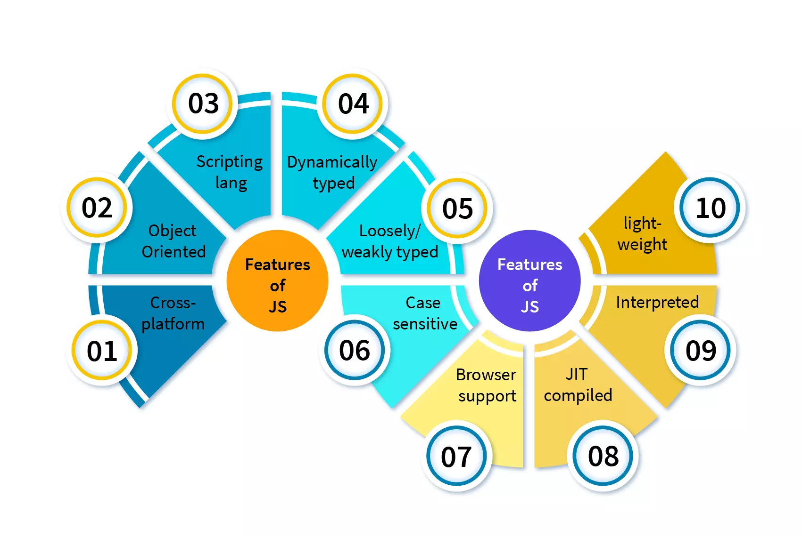
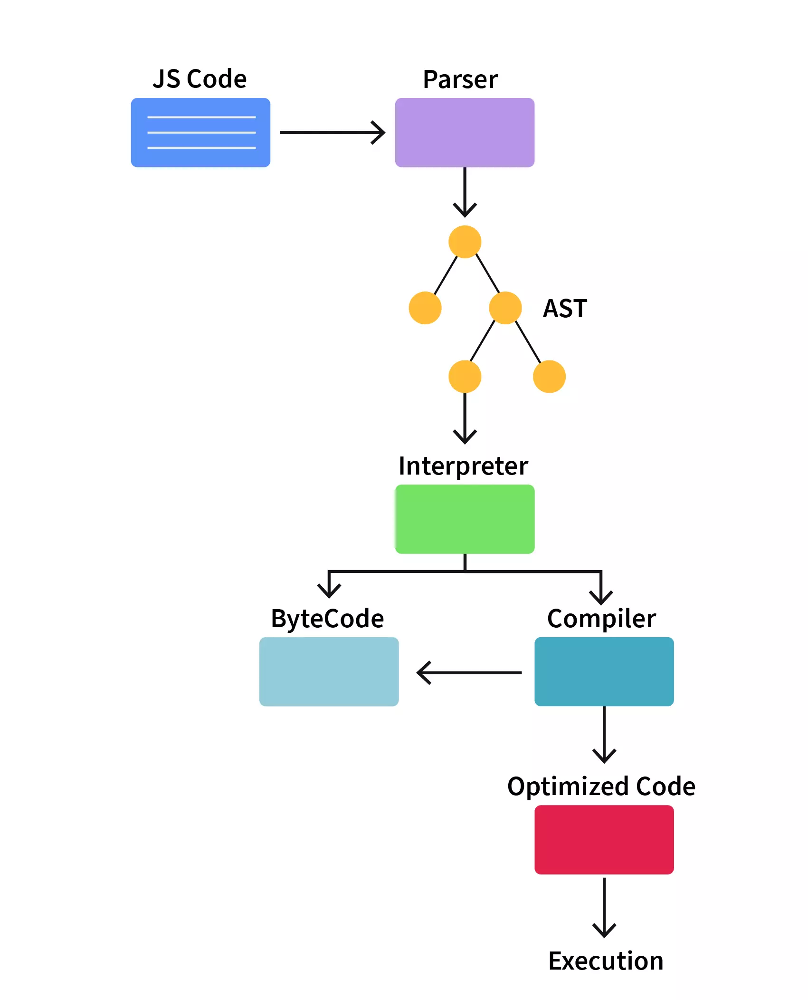

# What is JavaScript

> "_Javascript is the duct tape of the Internet._ -Charlie Campbell."

Have you ever thought about the programming language which powers the web? The most commonly used programming language in the world? Yes, it is Javascript but what is Javascript and where do we use it.

In a web page, HTML is used to structure the page, CSS is used to add styling like colors, fonts, etc but a web page with only HTML and CSS is static, meaning a user cannot really interact with the page, here is where Javascript comes in.

**JavaScript (JS)** is a lightweight, interpreted, or just-in-time compiled programming language with first-class functions. While it is most well-known as the scripting language for Web pages, many non-browser environments also use it, such as Node.js, Apache CouchDB and Adobe Acrobat. JavaScript is a prototype-based, multi-paradigm, single-threaded, dynamic language, supporting object-oriented, imperative, and declarative (e.g. functional programming) styles. Read more about JavaScript.

woof that was quite a lot now in easy words,

**Javascript** is a cross-platform, interpreted, object-oriented, just-in-time compiled scripting language. It is used to make web pages interactive(for example if the user clicks a button then the theme of the website changes, or after scrolling the page a pop-up message may be displayed).It is used to make dynamic web pages. JavaScript has a standard library of objects, such as Array, Date, and Math, and a fundamental set of language elements such as operators, control structures, and statements. Javascript can be used for both client and server side programming.

---

---

# History of JavaScript

- In September 1995, Brendan Eich, a programmer at Netscape developed a programming language in just 10 days.
- This language was initially called Mocha, then LiveScript.
- In December 1995 Netscape and Sun(the organization that owned Java) had a license agreement regarding Javascript(then LiveScript) hence it was renamed to Javascript and specifically "Java" script because Java was the most popular language at that time and this would help the marketing of Javascript as well.
- Javascript grew rapidly since then and in 1997 ECMA was given the responsibility to create a specification for the language (more on this in What is 'ECMAScript and how is Javascript related to it?' section)
- Today Javascript is used by millions of developers and is used in major sites such as Google, Facebook, Twitter, etc.

_**Takeaway**_: Javascript was created by Brendan Eich in September 1995. It was initially called Mocha, then LiveScript, and finally Javascript.

---

---

# Features of JavaScript

- **Cross-platform**: Javascript is supported by many OS such as Windows, macOS, Linux, etc.
- **Object Oriented**: Javascript is an object oriented programming language, but it is not a class based OOP language like Java, C++, etc. It is a prototype based OOP language.

You might be familiar with class based OOP in Java or C++ where we write a class, objects are instantiated for it and when we want the inheritance to happen we create another class which inherits from the parent class specified, where as in prototyped based OOP there is no such concept of classes objects directly inherit from other objects this is possible because every object has another object called Prototype attached to it by default which acts as a template object from which the object can inherit properties and methods.

- **Scripting language**: Javascript is a scripting language it depends on the browser for the execution of scripts. It is mostly used as a client-side scripting language this means that it runs on the client's system (browser) and handles the webpages displayed to the user and the processing related to it such as cookies, sessions, local storage.
- **Dynamically typed**: Javascript is dynamically typed, it means type checks happen at run-time. In JS we don't have to explicitly declare what type of information will be stored in a variable in advance. For example when we declare var a, now a can have a string stored in or a number as well.
- **Loosely/weakly typed**: Loosely/weakly typed languages allows for implicit conversion of types. For example, in Javascript we can declare a var a and give it some value and if we use + operator with a string variable a will be treated as string and as a number if we do the operation with a number, var a is converted implicitly here.
- **Case sensitive**: Javascript is sensitive to the case of the letters.
- **Browser support**: Javascript is supported by all major web browsers example Chrome, Firefox, Safari, etc.
- **JIT compiled** is compiled by a JIT(Just in time) compiler which converts the JS code to byte code.
- **Interpreted**: Javascript is using an interpreter to convert the byte to machine code hence is it an interpreted language. light weight and interpreted language.
- **light-weight**: Light weight refers to a language which has fewer language constructs(any syntactically allowable part of a language such as `if..else`,`functions` etc.), since JS fits this criteria it is a light weight programming language. (Note: It should be noted that with each new version released new constructs get added so JS is getting less light weight but it is still light weight compared to other programming languages like C++, Java etc.)

---

---

# Applications of JavaScript

- **Excellent user interactivity**: When you search for something you see that the search suggestions appear, when you fill a form and click submit, the form is submitted all these are because of Javascript, it allows users to interact with the webpage allowing us to build amazing websites and web apps.
- **Web and Mobile app creation**: Javascript based frameworks like React, Angular, Vue allow us to build robust web applications. Example: Facebook, Netflix have been built using React. Upwork, PayPal with Angular, and so on. We can also use a JS based framework called React Native to build mobile applications. Example: Uber eats, Discord, Pinterest, etc.
- **Server-side development**: We can also use Javascript to develop the back end infrastructure of a web application by using Node.js. Example: Netflix, Medium, Trello, etc. use Node.js on the server side.
- **Game development**: Javascript can also be used to develop browser based games some of them are HexGL, CrossCode, etc.
- **Art**: We can also make digital art on the HTML5 canvas by using JavaScript based libraries.

---

## Client side use of JavaScript

- Javascript is mostly used for client side scripting. (Code is run on the client's browser)
- It can be used to modify the webpage's user interface (the browser and its DOM) and make pages interactive.
- It deals with client side processing like cookies, sessions.
- It deals with the storage of the web browser i.e. local and session storage.
- For example:
  - If the user selects a dark theme for a website once, the website is always in dark theme whenever the user re-visits the page, this is because the user's preference is stored in local storage by Javascript.
  - Based on the time at the user's location the theme of the website changes or responses to any user events like mouse actions, form input, etc. this is client side Javascript in action, it allows for interactivity.

_**Takeaway**_: Client side JavaScript is used to manipulate the contents of a webpage, provide user interaction etc.

## Server side use of JavaScript

- Javascript can also be used to for server side development. This is possible because of Node.js.
- Node.js is an application runtime environment that allows us to use JavaScript for building server-side applications.
- We can do things like database queries, network requests, read/write files on the server, running web servers, interacting with other servers, handling data sent to the server, etc.
- Server side scripting is responsible for showing dynamic content on the webpage.

_**Takeaway**_: Server side JavaScript is used for server side development it can do things like database queries, network requests, read/write files, running webservers, etc. Server side JavaScript is possible because of Node.js.

---

---

# Javascript engine

- We have discussed previously that Javascript can be executed by the browser to further refine this statement, Javascript is actually executed by the Javascript engine which is embedded in the browser.
- The Javascript engine is a special program which can execute JS code not only in the browser but also on the server side and basically any machine which has this engine.
- This engine is also sometimes called as "JavaScript virtual machine".
- Different browsers use different JS engines though they are similar in operation.
- Example: Chrome, Opera, Edge use V8 engine. Firefox uses SpiderMonkey IE uses Chakra

---

## How do engines work?

When Javascript was first created it was mainly an interpreted language because the JS engine used an interpreter to execute the code, but now-a-days all modern browsers use a combination of an interpreter and JIT(Just in time) compiler to execute the code. In a broad sense we can say JS engines work as follows:

- **Parsing**: The engines reads the script and generates an AST(Abstract Syntax tree), this is the parsing phase.
- **Interpretation**: Then the interpreter converts the AST to byte code.
- **JIT(Just-in-time) compilation** the interpreter is creating the byte the JIT compiler tries to optimize this code as much as possible.
- **Execution**: Then finally the optimized code is executed.

Note that different JS engines have different architectures and they may have additional components as well. For example, Chrome's V8 engine has a compiler called TurboFan, Mozilla's SpiderMonkey has IonMonkey JIT Compiler. Optimizations are performed at each step by the engine.

What Javascript can do greatly depends on the environment it is running on, for example, if use Node.js it can be used for server side development and do things like doing network requests, running web servers, etc.

Where as In-browser can do things related to the webpage let's discuss more about this in the following sections:

---

## What can in-browser JavaScript do? 

In-browser JavaScript(Client-side Javascript/Javascript executed in the browser) is capable of doing all the things related to webpage manipulation, user interactivity, and the webserver.

For example, it can,

- Modify the content in the page, change the styles or even add a new HTML page
- Handle user events like mouse clicks, key presses etc.
- It is capable of sending requests to the remote servers for uploading and downloading of files.
- It can store data on the client side, this is called as local storage.
- It can implement sessions and cookies.

---

## What in-browser JavaScript cannot do? 

Though in-browser JavaScript can do many things, it is also restricted in its capabilities in order to protect the user's data as harmful entities may try to access the private information or endanger user's data. Some of the restrictions are cannot directly perform OS functions, one tab/window does not know about the other.

- **Cannot directly perform OS functions**:
  - In-browser JavaScript cannot directly perform OS functions like accessing files on the hard disk, interacting with other devices, etc.
  - Though it can do those things in a limited way like:
  - If the user needs to upload files to the browser then it is possible.
  - If the user needs to use other devices like a phone and camera it is possible if the user gives the permission, this is so that the browser will not use those devices on its own and collect the data.
- **One tab/window does not know about the other**:
  - Javascript from one page cannot access the other unless it is from the same domain. This is called the "Same Origin Policy".
  - This is to prevent say http://maliciousite.com from accessing data from http://myBank.com.
  - A workaround for this is that if both pages agree for data exchange and there exists a certain JS code that can handle it, then it is possible for two different pages from different domains to access each other's data.

---

---

# What makes JavaScript Unique?

At a glance the four greatest things about JavaScript would be:

1.  It can be fully integrated with HTML and CSS
2.  Javascript doesn't over-complicate things, simple things are done in a simple way.
3.  It is supported by all major browsers and it is enabled by default in those browsers.
4.  There are numerous frameworks written in Javascript like React, Angular, Vue, React Native, etc. which are used world-wide to develop seamless web and mobile applications.

Javascript is the only language in the world which offers a combination of these key features, this is what makes Javascript unique.

---

---

# Advantages of JavaScript

- **Less server load** runs on the client side, hence the load on the server is less.
- **Rich interface** makes the creation of rich and complex interfaces possible.
- **Speed**: Javascript can immediately run on the client side without the need for outside resources hence it is very fast.
- **Browser support** is supported by all major browsers.
  **Interoperability**: Javascript can be used in various kinds of applications because it can seamlessly work with other languages like PHP and Pearl.
- **Simplicity** is a simple and easy-to-learn language.
- **Popularity** is the most popular and widely used programming language on earth.
- **Various frameworks** has several frameworks like React, Vue, Angular, React Native which makes development easier.
- **Versatility** can be used for both client side and server side development. We build a full stack application solely using Javascript.

---

---

# Limitations of JavaScript

- **Client-Side Security** Javascript code is run on the client-side, there is a higher chance for bugs and other lapses to be exploited by harmful entities. This makes some users disable Javascript entirely
- **Different browsers different results** different browsers use different engines sometimes the result can be different for the same code but nowadays such cases are minimal.
- **No Multithreading or Multiprocessing** does not have multithreading or multiprocessing capabilities.
- **No reading/writing of files**: Javascript does not allow direct reading/writing files due to security reasons.

---

---

# What is ECMAScript

After its birth in 1995, Javascript grew rapidly hence there was a need to standardize it.

In 1997 this responsibility was given to ECMA (the European association for standardizing information and communication systems) and a standardized version of Javascript was created, this version is ECMAScript. Organisations can use this standard to develop their implementation of JavaScript. The ECMAScript standard is documented in the ECMA-262 specification.

---

---

---
