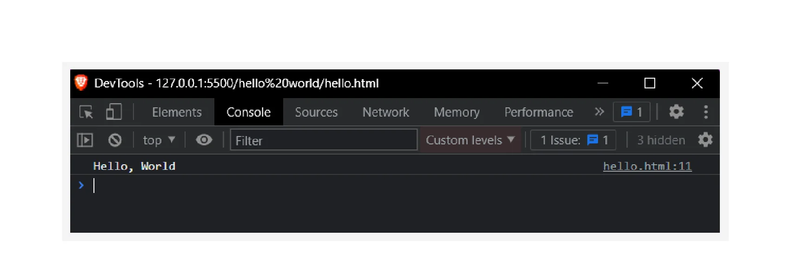
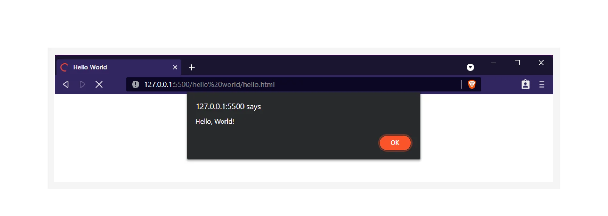
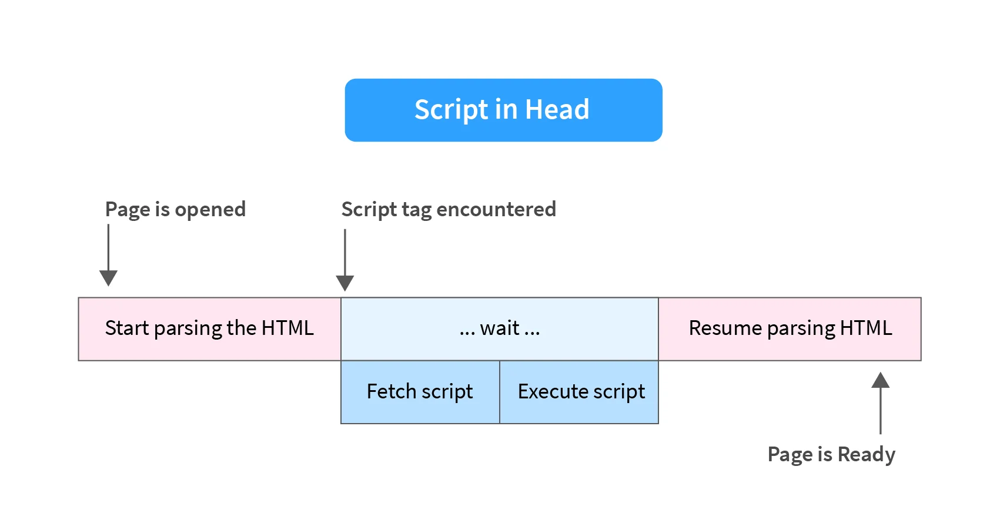
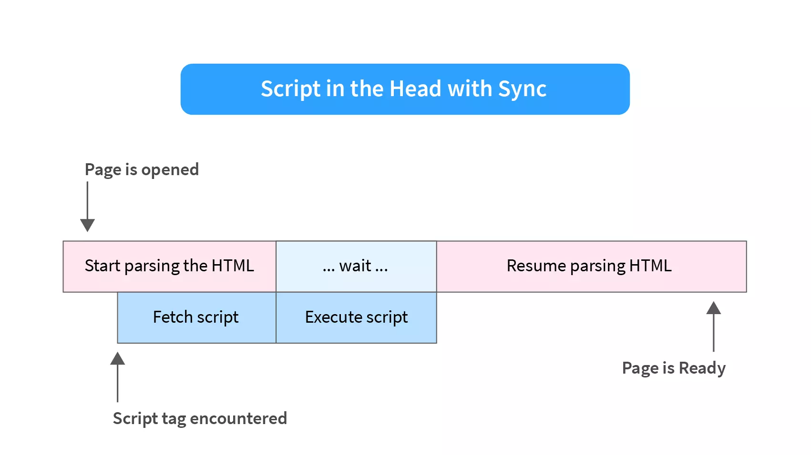
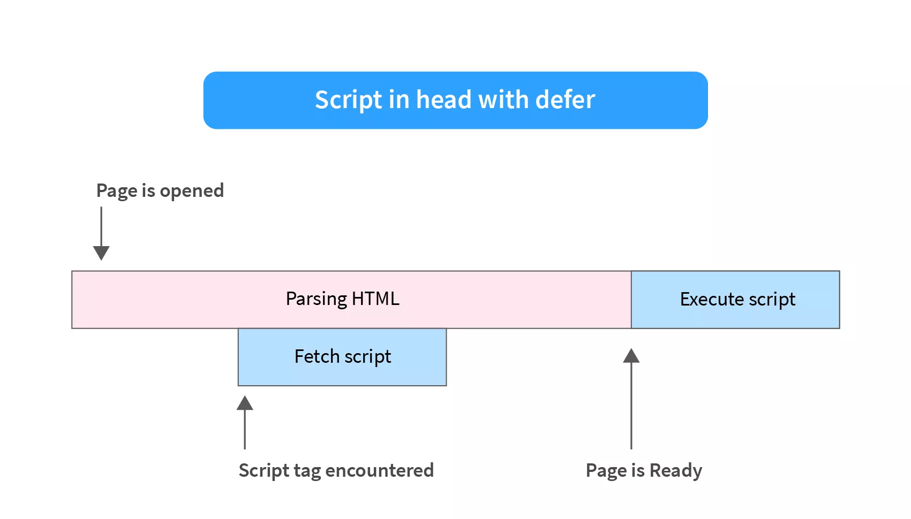

# Introduction to Hello World in JavaScript

If you ask programmers what was their first program? Most of them would say the "Hello, World" program.  
It is a simple program that prints a Hello, World! message on the screen, and it’s a good way to make sure your development environment is properly configured.

In this article, you will begin your journey into programming by exploring different ways to write the hello world in JavaScript.

---

---

# How to Insert JavaScript into an HTML Page

Before we see different ways to print "Hello World" in JavaScript, we must know how to add JavaScript code to an HTML page.

There are two ways you can insert a JavaScript program into an HTML document.

- Internal JavaScript
- External JavaScript

Both methods make use of the `<script>` tag to do this. Let's go over both methods.

---

## Internal JavaScript

When using internal JavaScript, we directly put the code inside of the `<script>` tag. When the browser encounters this tag, it automatically executes the code.

Let's see an example:

```html
<!DOCTYPE html>
<html lang="en">
  <head>
    <title>Internal JavaScript</title>
  </head>
  <body>
    <!-- HTML code here -->

    <script>
      // JavaScript code here
    </script>
  </body>
</html>
```

We can put the `<script>` tag anywhere in our HTML. Mostly it is added either at the end of the `<body>` tag or inside the `<head>` tag. Both have its consequence that we will discuss later.

> The `//` is used to put comments inside the code, its only purpose is to explain the code to a human, and the comment is ignored by the browser.

---

## External JavaScript

When the lines of JavaScript code increase, it becomes difficult to maintain all the code inside HTML. That's why we use an external dedicated JavaScript file. This file is then linked to the HTML using the `<script>` tag.

> JavaScript file ends in a .js extension.

Here is how you use the `<script>` tag to link a JavaScript file:

```javascript
<script src="/path/to/script.js"></script>
```

The src attribute contains the path to the JavaScript file.

- */path/to/script.js* is an absolute path to the script from the root folder.
  - An **absolute path** refers to the complete details needed to locate a file or folder, starting from the root element and ending with the other subdirectories. It is the full path of a file or folder.
- We can also provide a relative path, For example, if the directory structure is as follows:
- _.
  ├── index.html
  └── script.js_

  that is, if both the *script.js* and *index.html* are in the same folder, then we can just write *src="./script.js"* in the index.html file.

  - **Relative Path** is the hierarchical path that locates a file or folder on a file system starting from the current directory.

- You can even provide a URL in the *src* attribute to insert a remote JavaScript file, for example:

  ```javascript
  <script src="https://code.jquery.com/jquery-3.6.0.min.js"></script>
  ```

Again, you can put an external script tag anywhere.

**Note 📝**

- Only put simple scripts in HTML.
- Using separate files allows the browser to cache it (store in memory for future use). This makes the pages load faster.
- If the `src` attribute of the `<script>` tag is set, then the code inside `<script>` (if any) is ignored.

> Takeaway:
>
> - We can add JavaScript to a web page using the `<script>` tag either by inserting it into HTML (internal JS) or linking an external file (external JS).

---

---

# 3 Ways of Printing Hello World in JavaScript

## Using console.log()

The console.log() is a function used to log messages on the web console.

A **function** in programming is like a black box that takes an input and returns an output by doing some processing.


```javascript
<script>console.log("Hello, World!")</script>
```

In our case, the console.log takes the text we want to display as input and prints it on the screen as the output.

**Output:** To see the output, open the HTML file with this script in your browser and press F12 or right-click and select inspect then switch to the second tab named console.

You will find the following output:



console.log() is often used in debugging the code (finding and fixing the errors).

---

## Using document.write()

document.write() is another function you can use to print Hello World in JavaScript. Unlike console.log it prints the message on the HTML document instead of the console.

Let's try it as follow:

```javascript
<script>document.write("Hello, World!");</script>
```

To see the output, open the HTML document in your browser:


There is a better alternative to display text on an HTML document using DOM manipulation which is not difficult but beyond the scope of this article.

---

## Using alert()

The last function we will use to print Hello World in JavaScript is alert.  
This function displays a pop-up box over the current window with the specified message.

```javascript
<script>alert("Hello, World!");</script>
```



---

---

# Modern Markup

The `<script>` tag has a few attributes that are rarely used nowadays but can still be found in old code:

### The Type Attribute: `<script type=...>`

The old version of HTML - HTML4 required this attribute. It's no longer required, although modern HTML - HTML5 uses it to define a script as a module.

### The Language Attribute (Deprecated): `<script language=…>`

This attribute was used to define the language of the script. It is no longer required as JavaScript is the default language.

---

# The Async and Defer Attributes

Earlier in the article, we stated that we can place the `<script>` tag anywhere in the HTML code but where we do it has its consequence.

We will first discuss what happens when we put the script tag in the head and at the end of the body tag and then learn about two newly added attributes in HTML5 to alter the behavior of script loading and execution.

---

## Placing script in the head tag

Consider the following example:

```HTML
<!DOCTYPE html>
<html lang="en">
  <head>
    <title>Script in Head</title>
    <script src="script.js"></script>
  </head>
  <body>
    <h1>Hello, World</h1>
  </body>
</html>
```

The HTML is parsed until the `<script>` tag is encountered. At that point, parsing of the HTML is blocked and a request is made to fetch (download) the script file. Once the script is executed, HTML parsing resumes again.

This means that placing the `<script>` tag in the head tag may delay the rendering of the HTML especially if the script has many lines of code. In our case, we will see `<h1>Hello, World</h1>` after the script.js is downloaded and executed.

Here is a diagrammatic representation of this case:



One more issue possible with placing the script in the head tag is that in some cases if you are trying to operate on items that are on the page, you will get errors, and/or your code will not appear to work because the script has executed before the rest of the page has finished loading.

---

## Placing script at the end of the body tag

Because of the issues of the previous method, placing scripts at the end of the body tag is preferred:

```HTML
<!DOCTYPE html>
<html lang="en">
  <head>
    <title>Script in Head</title>
  </head>
  <body>
    <h1>Hello, World</h1>

    <script src="script.js"></script>
  </body>
</html>
```

Now, the parsing is done without any pauses, and when it is finished, the script is fetched and executed. This makes the page appear faster to the user.

Here is the diagrammatic representation for this method:


---

## Using async and defer

async and defer are `<script>` tag attributes that can be used to increase website loading times.

With async, the file gets downloaded asynchronously and then executed as soon as it’s downloaded. Example:

```html
<script async src="script.js"></script>
```

With defer, the file gets downloaded asynchronously but executed only when the document parsing is completed. Example:

```html
<script defer src="script.js"></script>
```

> Loading a script simultaneously with the web page is called asynchronous loading.

Let's look at the diagrammatic representation of both:.

**Async Loading**



**Defer Loading**



---

## Async vs Defer

| Async                                                                                                                                                                                          | Defer                                                             |
| ---------------------------------------------------------------------------------------------------------------------------------------------------------------------------------------------- | ----------------------------------------------------------------- |
| async blocks the parsing of the page.                                                                                                                                                          | defer does not blocks the parsing of the page                     |
| Scripts with async are executed when they become available.                                                                                                                                    | Scripts with defer are executed in the order they appear in HTML. |
| In terms of page rendering, defer is better than async. Defer is similar to putting the script at the end of the body tag, except that the script is downloaded in parallel with HTML parsing. | async may cause a delay in page rendering.                        |

---

---

---
