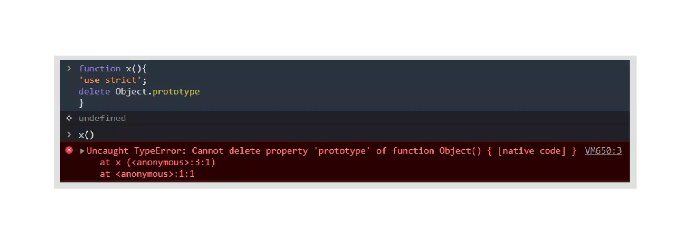
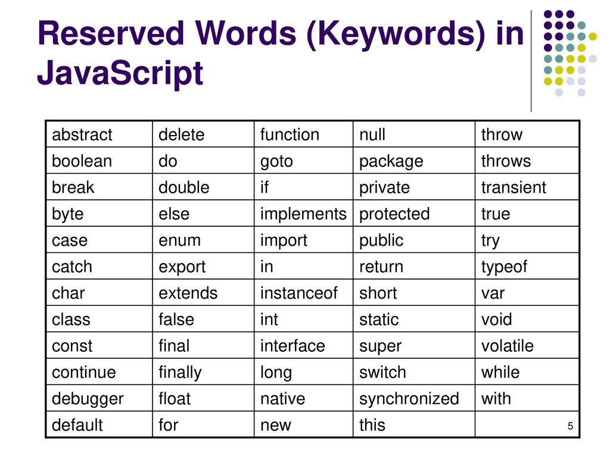

# Introduction to Javascript variables

In JavaScript, a variable is a name given to a **memory location** that is used to store any *type of data*. As the name suggests, variables mean it can vary, i.e., data stored in a variable can be changed or updated later in the program if required. In short, a variable is a symbolic name for (or reference to) a data or a piece of information.

**Highlight:** A Javascript variable is a **container**, not a value, this means that variables aren’t themselves values; they are a container for values.

**Example:** Think of a box named **Age** which stores the age of a person. So, the name is the variable name, and the age stored in it is the value.


---

---

# Rules/Identifiers While Declaring a Javascript Variable

To declare a Javascript variable, one must know the rules to follow, as one can mess up the code while declaring a variable. If one doesn't follow the rules, he/she may end up getting an error.

**Rules are as follows:**

- **Variables are case-sensitive** in Javascript. This means that `schoolName` and `schoolname` are considered different variables.
- We can use letters, digits, symbols like **dollar sign** ($) and **underscore** ( \_ ) in a variable name.
- We **cannot** start a variable name with a **digit** (0-9).
- We cannot use any of the reserved keywords (`function`, `return`, `typeof`, `break`, etc.) of Javascript as a variable name.

### Important Points

- Javascript allows multiple white spaces and even line breaks in a declaration of a variable.
- We can separate different variable declarations using a comma.
- In Javascript, we can store any type of value in a variable and also change it any time.

### Examples:

1.  Declaring a JavaScript variable using line breaks and spaces:

```javascript
var a = 25;
```

2.  Declaring two variables in a single line separated by comma:

```javascript
var b = 1,
  c = 2;
```

3.  Using reserve keywords while declaring a variable:

```javascript
var return = 5; //Will give error, as return is a keyword in Javascript
```

4.  Valid variable name examples:

```javascript
var my_school; //using underscore
var one$23; //using digit and dollar sign
```

5.  Invalid variable name examples:

```javascript
var 123name ; //variable cannot start with a digit
var variable@ ; //variable cannot contain '@' symbol
var break; //break is a reserved keyword in JS, so we can't use it as a variable
```

---

---

## Syntax (Correct & Incorrect)

After knowing what is a Javascript Variable and the rules to declare it, we will dive into the syntax of declaring it.

### Correct Syntax:

```javascript
var <variable-name>;
var <variable-name> = <value>;
```

The above lines are the correct syntax to declare a variable. We will have detailed information on declaring a variable later in this article.

**Examples:**

```javascript
var aVariable;
var name = "Mark";
```

### Incorrect Syntax:

We should not declare variables using the following examples:

```javascript
aVariable; // This is not a declaration, it will give you the
        //value of "aVariable" if any, otherwise it will throw an error

name var; //"var" keyword should be written first.

var 'Mark' = name; //value should be on the right-hand side of the equals sign
```

---

---

# Declaring a Variable

One must create a variable before using it. In programming terms, we call this declaring a variable. In Javascript, we can declare a variable using either let, var, or const keywords.

```javascript
var schoolName;
let address;
```

Here we are creating two variables, one using let and another using var. You can even try writing these lines in your web browser's console.

Currently, these variables **do not store any value**, they are just declared. In other words, we have an empty box named `schoolName` and `address`.

If you want to see the value of `schoolName`, the output will be **undefined**. We will see what is meant by undefined in later part.

---

---

# Declaring Variables Without the Var Keyword?

We have seen how to declare a variable with var. Now we will see how we can declare a variable without using neither var nor let.

To declare a variable without using any keyword, we have to just write the variable name and must assign a value to that variable. On doing this, the variable becomes a **global variable** (this line means that the scope of the variable is global. The Scope of the variable is described later in this article.).

```javascript
age = 25; //declaring a variable without using var
console.log(age); //output: 25
```

Try running the above lines in your web browser's console.

However, it is not recommended to declare a variable without using var as it may alter the value of an already existing global variable.

**Note:**

```javascript
age; // trying to declare a variable "age"
```

**This line is not a declaration**. If you execute this line in the console, it will give you the value of **age** if it is already declared, else will result in a `ReferenceError`.

---

---

# Initializing a Variable

After you have declared a variable, you can initialize that variable with a value. This initialization can be done by just writing the variable name followed by an equals sign and then the value you want the variable to store.

```javascript
schoolName = "XYZ School"; //schoolName stores "XYZ School"
address = "abc"; //address stores "abc"
```

Now, try writing these lines in the console. After writing these lines, you can write only the variable names and press enter, the output will be the value stored in it.

```javascript
schoolName; //output: XYZ School
address; //output: abc
```

Note: You can even declare and initialize a variable in a single line. Example:

```javascript
var age = 20; //declaring and initializing at the same time
```

---

---

# Undefined vs. Undeclared Variables

### Undefined variables

After learning initialization and declaration of variables, you have seen that when we declare a variable without initializing it, then the variable is said to be **undefined**. That is, the variable is declared but not initialized with any value.

**Example:**

```javascript
var new_variable; //by default its value is undefined.

console.log(new_variable); //this will output: undefined
```

---

### Undeclared variables

Suppose you want to use a variable in a statement, but the variable is not declared before. In this case, the code will throw a `ReferenceError` as the variable is not declared using **var** keyword. In short, if we access any undeclared variable, the code will cause runtime error.

**Example:**

```javascript
console.log(xyz);
```

Try running the above line in the console, and you will get an error showing that `==ReferenceError: xyz is not defined==`. This indicates that **`xyz`** is not declared earlier you are trying to access an undeclared variable.

---

---

# Non-Strict Mode

The default non-strict mode in JavaScript is sometimes called as **sloppy mode**.

In Javascript, unless we write **'use strict'** inside a code, the code remains in non-strict mode. In non-strict mode you have less restrictions on writing code, such as:

- One can declare same variable muliple times using **var** keyword.

  **Example:**

  ```javascript
  var two = 2;
  var two = 5;
  ```

  Here we are declaring the same variable two times, using **var**.

- One can actually declare a variable with **var** after you have initialized that variable. This will work only in non-strict mode.

  **Example**

  ```javascript
  name = "Mark";
  console.log(name); //This line will output: "Mark";
  var name;
  ```

  This code will work because of a **variable hoisting** in Javascript. We will discuss Hoisting in the later part of the chapter.

---

---

## Strict Mode

JavaScript introduced **strict mode** in ECMAScript 5. This mode is a way to get a restricted version of JavaScript, i.e., having some restrictions while writing code. Benefits of using strict mode:

- It eliminates some of the silent errors or warnings and instead throws errors to help in debugging.
- It makes it easier to write “secure” JavaScript code. To learn about the "secure code", you can learn in detail by reading any article on "strict-mode in JavaScript" on google.
- It prevents users from doing “unsafe” actions, such as deleting a property from a global object. Example: deleting `Object.prototype` results in an error.



We can either make the whole code(global scope), or individual functions run in strict mode. For making a function or whole script run at strict mode, we just have to write **'use strict'** at the start.

**Restriction on variable declarations in strict mode:**

- In normal JS, if we don't use var, we create a global variable, but in the strict mode, we cannot do that, thus preventing us from accidentally creating a global variable.

  **Example:**

  ```javascript
  function func() {
    "use strict";
    variabl = "any misspelled variable";
  }
  func(); //calling the above function.
  ```

  If we execute the above code, it will give a reference error, as **variabl** is **not declared** first, and also, it will not create any global variable named **variabl**.

---

---

# JavaScript Variable Hoisting

The most important and unique feature in JavaScript is **Variable Hoisting** or **var Hoisting**. In JavaScript, all variable declarations are processed before any other part of the code is executed. Thus declaring all the variables at the top of the code. This feature is called **hoisting** in JavaScript. The declarations are moved to the top of the global code or to the top of a function, depending on where it is declared. This movement of declarations to the top of the function or global code is done automatically by the JS itself internally. We don't actually see the change. This will be cleared by the examples below. Hoisting also initializes the variable with "**undefined**".

**Example:**

```javascript
hoistedVariable = 1;
var hoistedVariable;
```

The above code is same as :

```javascript
var hoistedVariable;
hoistedVariable = 1;
```

**Note:** Hoisting only moves the declaration to the top of the scope(either global or function). It never moves the assignment lines.

**Example:**

```javascript
console.log(x); //output: undefined
var x = 2;
console.log(x); //output: 2

// The above code is same as:

var x; //default value: undefined
console.log(x); //output: undefined
x = 2;
cosole.log(x); //output: 2
```

Though hoisting helps to, by default, declare variables at the top, it is **highly recommended** to declare variables at the top of a function or global manually because one may get confused if he/she uses a variable before declaring it.

**Note**: Variables declared using **let** and **const** are also hoisted but they are not initialized with **undefined**. So, if someone tries to use variables before the declaration, then it will throw an exception.

---

---

# The Difference Between 'var' and 'let'

You might be wondering what is let, as we haven't discussed it in detail. Here we will explain the difference between var and let. First of all, both keywords are used to declare variables in JavaScript.

- The main difference between var and let is that the scope of the variable that is defined by **let** is limited to the block in which it is declared, whereas the variable declared using **var** has the global scope, i.e., can be used throughout the code.
- If we declare a variable using **var** outside of any block (i.e., in the global scope), then the variable gets added to the **window** object, whereas variables declared with **let** will never get added to it.
- We cannot declare the same variable multiple times if one of them is declared using **let**, whereas we can declare the same variable any number of times using **var**.
- Variable hoisting can be done using **var**, but hoisting cannot be done using **let**.

Try the below codes in your browser's console and you will understand it better.

**Example 1:**

```javascript
let x = 1; //doesn't get added to the window object
var y = 2; //gets added to the window object

console.log(window.x); // output: undefined
console.log(window.y); // output: 2
```

**Example 2:**

```javascript
function scopes() {
  var x = 2;
  let y = 3;
}

console.log(x); // output: 2, as the variable is globally scoped.
console.log(y); // will result in a referenceError
```

In this case, the scope of the variable y is only limited to the function, that’s why we cannot find the reference to the variable y outside the function, thus resulting in the reference error. We will describe the Variable Scope in the later part of this article.

---

---

# Changing the Value/Updating a Variable

Once a variable is declared or initialized, we can change its value anytime and anywhere within its scope. It is similar to re-initializing the variable. We can update/change the value by just typing the variable name followed by an equals sign and then followed by the new value we want it to store.

**Example:**

```javascript
var variable = 10; // at first the value is 10

variable = 15; // the value gets updated to 15
variable = 20; // now the value is 20 for the variable
```

---

---

# JavaScript Variable Scope

Scope of a variable means, **the visibility of a variable**. That is, the parts of our program where you can use a variable.

In JavaScript, there are only two types of variable scopes:

- Local Scope
- Global Scope

### JavaScript local variable

A Local Variable is only visible **inside a function** where it is defined. We cannot use a local variable outside the function where it is defined. On doing so, it will result in reference error.

**Example:**

```javascript
function prints() {
  var local_var = 2; // a local variable with value 2
  console.log(local_var);
  //the local_var can be used anywhere inside this function
}
console.log(local_variable); //this line will result in ReferenceError,
//as local_variable is not visible in this line
```

### JavaScript global variable

A **Global Variable** has a **global scope** which means that it can be used and viewed anywhere throughout the program.

**For example:** We can use a globally declared variable inside a function.

```javascript
var global_var = 1;

function prints() {
  console.log(global_var); //output: 1
}
console.log(global_var); //output: 1
```

Since the global_var is declared globally, it can be used inside the function as well as outside the function (i.e. in the global scope).

---

---

# JavaScript Reserved Words

In Javascript, there are some reserved keywords that one cannot use as a variable name. Some of the reserved words are given in this table:



---

---

# Javascript Dynamic Typing

You might have heard that JavaScript is called "**a dynamically typed language**". This means that the data type of a variable is not fixed. A variable can store any type of data, and the user can achieve this without specifying the type of data he/she wants to store(e.g.: number, string, objects, arrays, etc.).

Also, one can change the stored value to any type of data, anytime freely.

**Examples:**

```javascript
var variable = "Hello World!";

//lets print the data type of this variable
console.log(typeof variable); //this will print 'string'

//Now let's update the value to a number
variable = 2; //By this line, we update the value of variable to 2

//Now let's print the data type of updated variable
console.log(typeof variable); //This will print: 'number', since 2 is a number
```

Try running these lines in console for better understanding.

---

--

# JavaScript Constants

You have seen that variables are those, whose values could be changed if required. Now, JavaScript also lets you declare constants. We declare a constant using the keyword **const**;

**Syntax:**

```javascript
const <variable-name> = <value>;
```

These constants are similar to variables but have some properties which are different from variables, such as:

- The constant **must be initialized** when you declare it, otherwise, it will throw a " SyntaxError: Missing initializer in const declaration ".
- Once assigned a value to a constant, you can’t re-assign values afterward. That is, a value is fixed to a constant.

**Example 1:**

```javascript
var ages;//we can declare a variable without initializing it.
const age; //It will throw an error as we haven't initialized the constant.
```

**Example 2:**

```javascript
var age = 20;
age = 25; //We can update values of variables like this

const pi = 3.142;
pi = 5; // This line will throw a TypeError: Assignment to constant variable.
```

**Note:** Though we cannot change the value of the constant, but if the constant value is an object, then we can modify the object's properties.

**Example:**

```javascript
const car = { company: "BMW" };

car = { company: "Audi" };
//The above line will throw an error, because we are trying to reassign
// value to a constant, which is not correct.

//To change the company name we can do the following trick
car.company = "Audi";
console.log(car.company); //output: 'Audi'
```

You can even add, or update or remove properties from a **constant object**, because you are just changing the details of the object, not the reference. The constant will still point to the same object.

---

---

---
